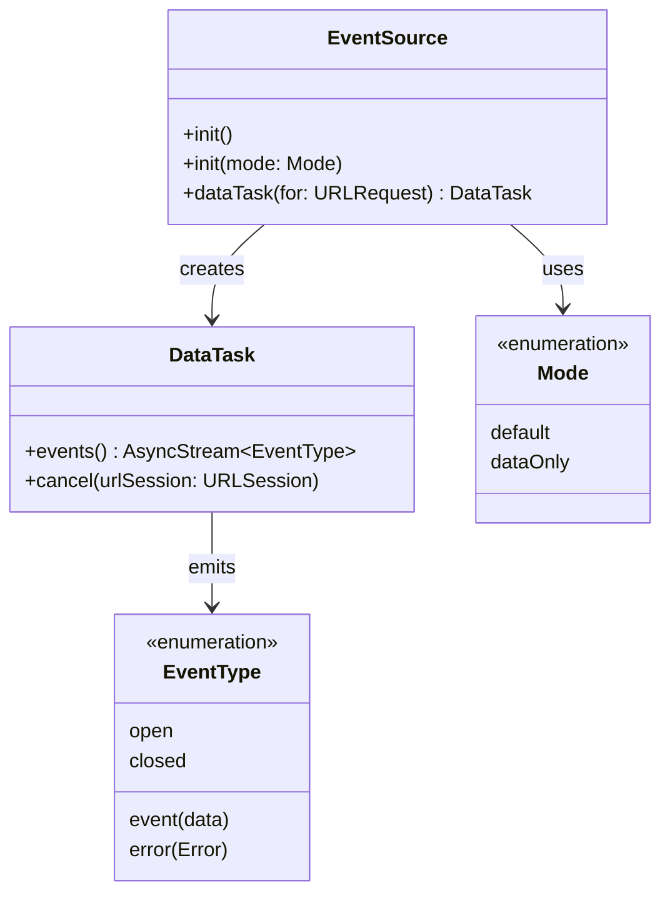

# EventSource

[](https://github.com/Recouse/EventSource/actions/workflows/ci.yml)
[](https://swiftpackageindex.com/Recouse/EventSource)
[](https://swiftpackageindex.com/Recouse/EventSource)

EventSource is a Swift package that provides a simple implementation of a client for [Server-Sent Events](https://html.spec.whatwg.org/multipage/server-sent-events.html) (SSE).

It allows you to easily receive real-time updates from a server over a persistent HTTP connection, using a simple and efficient interface. It also leverages Swift concurrency features to provide a more expressive and intuitive way to handle asynchronous operations.

> [!Note]
> Please note that this package was originally developed to be used in conjunction with another package, and as such, it may not cover all specification details. Please be aware of this limitation when evaluating whether EventSource is suitable for your specific use case.

## Features

- [x] Simple Swift API for SSE
- [x] Supports data-only mode
- [x] Data race safety with Swift 6
- [x] URLSession lifecycle management
- [x] Comprehensive error handling

## Installation

The module name of the package is `EventSource`. Choose one of the instructions below to install and add the following import statement to your source code.

```swift
import EventSource
```

#### [Xcode Package Dependency](https://developer.apple.com/documentation/xcode/adding_package_dependencies_to_your_app)

From Xcode menu: `File` > `Swift Packages` > `Add Package Dependency`

```text
https://github.com/Recouse/EventSource
```

#### [Swift Package Manager](https://www.swift.org/documentation/package-manager/)

In your `Package.swift` file, first add the following to the package `dependencies`:

```swift
.package(url: "https://github.com/Recouse/EventSource.git"),
```

And then, include "EventSource" as a dependency for your target:

```swift
.target(name: "", dependencies: [
    .product(name: "EventSource", package: "EventSource"),
]),
```

## Usage

### API Overview



### Usage Flow

```mermaid
flowchart TD
    A[Create URLSession] --> B[Create EventSource]
    B --> C[Create DataTask]
    C --> D[Process Events]
    D --> E{Event Type}
    E -->|open| F[Connection Ready]
    E -->|event| G[Handle Data]
    E -->|error| H[Handle Error]
    E -->|closed| I[Connection Ended]
    F --> D
    G --> D
    H --> J[Cancel if needed]
    I --> K[Cleanup]
    J --> L[dataTask.cancel(urlSession)]
    L --> K[End]

    style A fill:#e3f2fd
    style L fill:#ffebee
```

### Basic Usage

Using EventSource is easy. Simply create a new data task from an instance of EventSource with the URLRequest of the SSE endpoint you want to connect to, and await for events:

```swift
import EventSource

Task {
    // Create independent URLSession (IMPORTANT: Do not use URLSession.shared)
    // Using URLSession.shared is dangerous because cancel() calls invalidateAndCancel()
    // which would affect the entire application's network functionality
    let sessionConfig = URLSessionConfiguration.default
    let urlSession = URLSession(configuration: sessionConfig)

    let eventSource = EventSource()
    let dataTask = eventSource.dataTask(for: urlRequest)

    for await event in dataTask.events() {
        switch event {
        case .open:
            print("Connection was opened.")
        case .error(let error):
            print("Received an error:", error.localizedDescription)
        case .event(let event):
            print("Received an event", event.data ?? "")
        case .closed:
            print("Connection was closed.")
        }
    }

    // Cancel connection with URLSession reference (required since v0.1.5)
    await dataTask.cancel(urlSession: urlSession)
}
```

### Data-only mode

EventSource can be used in data-only mode, making it suitable for popular APIs like [OpenAI](https://platform.openai.com/docs/overview). Below is an example using OpenAI's [completions](https://platform.openai.com/docs/guides/text-generation) API:

```swift
Task {
    var urlRequest = URLRequest(url: URL(string: "https://api.openai.com/v1/chat/completions")!)
    urlRequest.allHTTPHeaderFields = [
        "Content-Type": "application/json",
        "Authorization": "Bearer \(accessToken)"
    ]
    urlRequest.httpMethod = "POST"
    urlRequest.httpBody = """
    {
        "model": "gpt-4o-mini",
        "messages": [
            {"role": "user", "content": "Why is the sky blue?"}
        ],
        "stream": true
    }
    """.data(using: .utf8)!

    // Create independent URLSession for safe resource management
    let sessionConfig = URLSessionConfiguration.default
    let urlSession = URLSession(configuration: sessionConfig)

    let eventSource = EventSource(mode: .dataOnly)
    let dataTask = eventSource.dataTask(for: urlRequest)

    var response: String = ""
    for await event in dataTask.events() {
        switch event {
        case .event(let event):
            if let data = event.data?.data(using: .utf8) {
                let chunk = try? JSONDecoder().decode(ChatCompletionChunk.self, from: data)
                let string = chunk?.choices.first?.delta.content ?? ""
                response += string
            }
        default:
            break
        }
    }

    print(response)
    await dataTask.cancel(urlSession: urlSession)
}
```

## Migration Guide: 0.1.4 → 0.1.5

### Breaking Changes

- The `cancel()` method now requires a URLSession parameter
- URLSession lifecycle management is now the caller's responsibility

### Migration Steps

1. **Update cancel calls**: Change `dataTask.cancel()` to `dataTask.cancel(urlSession: urlSession)`
2. **Add URLSession management**: Store URLSession references in your SSE management classes
3. **Implement proper cleanup**: Call `urlSession.invalidateAndCancel()` when cleaning up resources

### Before (0.1.4)
```swift
let dataTask = eventSource.dataTask(for: urlRequest)
// ... process events
dataTask.cancel() // ❌ No longer works
```

### After (0.1.5)
```swift
// Create independent URLSession (NEVER use URLSession.shared)
let sessionConfig = URLSessionConfiguration.default
let urlSession = URLSession(configuration: sessionConfig)

let dataTask = eventSource.dataTask(for: urlRequest)
// ... process events
await dataTask.cancel(urlSession: urlSession) // ✅ Correct
```

## Advanced Usage

> [!NOTE]
> This section provides recommended patterns and best practices for production environments. These contents are based on practical experience and are not core library features or required components. Developers can selectively adopt or adjust them according to project requirements.

### URLSession Lifecycle Management

Starting from version 0.1.5, EventSource requires developers to explicitly manage URLSession instances. This design provides better resource control, but also requires developers to take on corresponding management responsibilities.

**⚠️ CRITICAL SAFETY WARNING**: Never use `URLSession.shared` with EventSource! The `cancel(urlSession:)` method calls `urlSession.invalidateAndCancel()`, which would invalidate the shared URLSession and break all network requests in your application.

```swift
import EventSource

Task {
    // Create independent URLSession for each EventSource connection
    let sessionConfig = URLSessionConfiguration.default
    sessionConfig.timeoutIntervalForRequest = 60.0
    sessionConfig.timeoutIntervalForResource = 300.0
    let urlSession = URLSession(configuration: sessionConfig)

    let eventSource = EventSource()
    let dataTask = eventSource.dataTask(for: urlRequest)

    // Process events
    for await event in dataTask.events() {
        // Handle events...
    }

    // Proper cleanup approach
    await dataTask.cancel(urlSession: urlSession)

    // URLSession will be automatically invalidated in the cancel call
}
```

### Production Environment Best Practices

#### Resource Management
- **Independent URLSession**: Create dedicated URLSession instances for each EventSource connection
- **Timely Cleanup**: Ensure `cancel(urlSession:)` method is called at appropriate times
- **Configuration Optimization**: Configure appropriate timeout and retry parameters based on usage scenarios

#### Error Handling
- Implement comprehensive error handling logic, including network errors, parsing errors, and connection interruptions
- Consider implementing automatic reconnection mechanisms (requires application-layer implementation)
- Ensure resources are properly released in error scenarios

#### Memory Management
- Avoid creating strong reference cycles in closures
- Release URLSession instances that are no longer needed in a timely manner
- Monitor memory usage of long-running SSE connections

### Recommended Connection Management Pattern

> [!TIP]
> The following is a commonly used SSE connection management adapter implementation in production environments. This is not an official library component, but a recommended pattern based on practical project experience. You can adjust it according to specific requirements.

For scenarios that require managing multiple SSE connections in SwiftUI applications or need complex state management, consider implementing the following connection management adapter:

```swift
import EventSource
import SwiftUI

/// SSE Connection Manager - Recommended production environment usage pattern
/// Note: This is not an official EventSource library component, but a recommended implementation based on best practices
@MainActor
final class SSEConnectionManager: ObservableObject {
    @Published var connectionState: ConnectionState = .disconnected

    private var currentDataTask: EventSource.DataTask?
    private var currentURLSession: URLSession?
    private var currentEventSource: EventSource?

    enum ConnectionState {
        case disconnected, connecting, connected, failed(Error)
    }

    /// Establish SSE connection and return type-safe data stream
    /// - Parameter urlRequest: Request for SSE endpoint
    /// - Returns: Decoded data stream
    func connect<T: Decodable>(_ urlRequest: URLRequest) -> AsyncStream<T> {
        return AsyncStream { continuation in
            Task {
                await disconnect() // Clean up any existing connection

                do {
                    connectionState = .connecting

                    // Create independent URLSession (Important: do not use shared)
                    let sessionConfig = URLSessionConfiguration.default
                    sessionConfig.timeoutIntervalForRequest = 60.0
                    let urlSession = URLSession(configuration: sessionConfig)
                    currentURLSession = urlSession

                    let eventSource = EventSource()
                    currentEventSource = eventSource

                    let dataTask = eventSource.dataTask(for: urlRequest)
                    currentDataTask = dataTask

                    connectionState = .connected

                    for await event in dataTask.events() {
                        switch event {
                        case .event(let eventData):
                            if let data = eventData.data?.data(using: .utf8),
                               let decoded = try? JSONDecoder().decode(T.self, from: data) {
                                continuation.yield(decoded)
                            }
                        case .error(let error):
                            connectionState = .failed(error)
                            continuation.finish()
                        case .closed:
                            connectionState = .disconnected
                            continuation.finish()
                        default:
                            break
                        }
                    }
                } catch {
                    connectionState = .failed(error)
                    continuation.finish()
                }
            }

            continuation.onTermination = { _ in
                Task { await self.disconnect() }
            }
        }
    }

    /// Disconnect and clean up resources
    func disconnect() async {
        if let dataTask = currentDataTask,
           let urlSession = currentURLSession {
            await dataTask.cancel(urlSession: urlSession)
        }

        cleanupResources()
        connectionState = .disconnected
    }

    private func cleanupResources() {
        currentDataTask = nil
        currentEventSource = nil
        // URLSession has been invalidated in the cancel call, no manual handling needed
        currentURLSession = nil
    }
}

// Usage example
struct ContentView: View {
    @StateObject private var sseManager = SSEConnectionManager()
    @State private var messages: [ChatMessage] = []

    var body: some View {
        VStack {
            // UI implementation...
        }
        .task {
            let stream: AsyncStream<ChatMessage> = sseManager.connect(urlRequest)
            for await message in stream {
                messages.append(message)
            }
        }
    }
}
```

### Custom Event Parser

EventSource supports custom event parsing logic through the `EventParser` protocol:

```swift
import EventSource

/// Custom event parser example
struct CustomEventParser: EventParser {
    mutating func parse(_ data: Data) -> [EVEvent] {
        // Implement custom parsing logic
        // For example: handle special format SSE data
        return []
    }
}

// Use custom parser
let eventSource = EventSource(eventParser: CustomEventParser())
```

> [!NOTE]
> In most cases, the default `ServerEventParser` is sufficient. Custom parsers are only needed when handling non-standard SSE formats or having special parsing requirements.

## Compatibility

* macOS 10.15+
* iOS 13.0+
* tvOS 13.0+
* watchOS 6.0+
* visionOS 1.0+

## Dependencies

No dependencies.

## Contributing

Contributions to are always welcomed! For more details see [CONTRIBUTING.md](CONTRIBUTING.md).

## Credits

* Mutex backport from [swift-sharing](https://github.com/pointfreeco/swift-sharing)

## License

EventSource is released under the MIT License. See [LICENSE](LICENSE) for more information.
