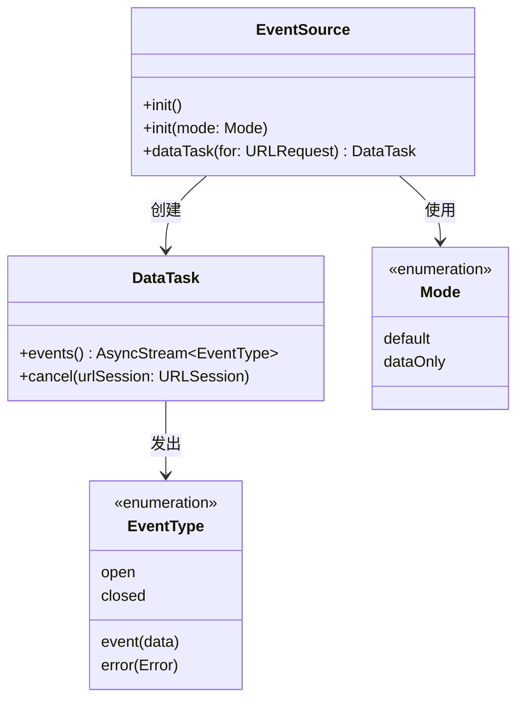

# EventSource

[English](README.md) | [中文](README_zh.md)

[](https://github.com/Recouse/EventSource/actions/workflows/ci.yml)
[](https://swiftpackageindex.com/Recouse/EventSource)
[](https://swiftpackageindex.com/Recouse/EventSource)

EventSource 是一个 Swift 包，为 [Server-Sent Events](https://html.spec.whatwg.org/multipage/server-sent-events.html)（服务器发送事件，简称 SSE）提供了简单的客户端实现。

它允许您通过持久的 HTTP 连接轻松接收来自服务器的实时更新，使用简单高效的接口。该库还利用 Swift 并发特性，为处理异步操作提供了更具表现力和直观的方式。

> [!Note]
> 请注意，此包最初是为与另一个包配合使用而开发的，因此可能不涵盖所有规范细节。在评估 EventSource 是否适合您的特定用例时，请注意此限制。

## 功能特性

- [x] 简单的 Swift API 用于 SSE
- [x] 支持纯数据模式
- [x] Swift 6 数据竞争安全
- [x] URLSession 生命周期管理
- [x] 全面的错误处理

## 安装

包的模块名称是 `EventSource`。选择以下安装说明之一，并将以下导入语句添加到您的源代码中。

```swift
import EventSource
```

#### [Xcode 包依赖](https://developer.apple.com/documentation/xcode/adding_package_dependencies_to_your_app)

从 Xcode 菜单：`File` > `Swift Packages` > `Add Package Dependency`

```text
https://github.com/Recouse/EventSource
```

#### [Swift Package Manager](https://www.swift.org/documentation/package-manager/)

在您的 `Package.swift` 文件中，首先将以下内容添加到包的 `dependencies` 中：

```swift
.package(url: "https://github.com/Recouse/EventSource.git"),
```

然后，将 "EventSource" 作为目标的依赖项包含进来：

```swift
.target(name: "", dependencies: [
    .product(name: "EventSource", package: "EventSource"),
]),
```

## 使用方法

### API 概览



### 使用流程

```mermaid
flowchart TD
    A[创建 URLSession] --> B[创建 EventSource]
    B --> C[创建 DataTask]
    C --> D[处理事件]
    D --> E{事件类型}
    E -->|open| F[连接就绪]
    E -->|event| G[处理数据]
    E -->|error| H[处理错误]
    E -->|closed| I[连接结束]
    F --> D
    G --> D
    H --> J[必要时取消]
    I --> K[清理]
    J --> L[dataTask.cancel(urlSession)]
    L --> K[结束]

    style A fill:#e3f2fd
    style L fill:#ffebee
```

### 基础用法

使用 EventSource 很简单。只需从 EventSource 实例创建一个新的数据任务，使用您要连接的 SSE 端点的 URLRequest，然后等待事件：

```swift
import EventSource

Task {
    // 创建独立的 URLSession（重要：不要使用 URLSession.shared）
    // 使用 URLSession.shared 是危险的，因为 cancel() 会调用 invalidateAndCancel()
    // 这会影响整个应用程序的网络功能
    let sessionConfig = URLSessionConfiguration.default
    let urlSession = URLSession(configuration: sessionConfig)

    let eventSource = EventSource()
    let dataTask = eventSource.dataTask(for: urlRequest)

    for await event in dataTask.events() {
        switch event {
        case .open:
            print("连接已打开。")
        case .error(let error):
            print("收到错误:", error.localizedDescription)
        case .event(let event):
            print("收到事件", event.data ?? "")
        case .closed:
            print("连接已关闭。")
        }
    }

    // 使用 URLSession 引用取消连接（自 v0.1.5 起必需）
    await dataTask.cancel(urlSession: urlSession)
}
```

### 纯数据模式

EventSource 可以在纯数据模式下使用，使其适用于像 [OpenAI](https://platform.openai.com/docs/overview) 这样的流行 API。以下是使用 OpenAI 的 [completions](https://platform.openai.com/docs/guides/text-generation) API 的示例：

```swift
Task {
    var urlRequest = URLRequest(url: URL(string: "https://api.openai.com/v1/chat/completions")!)
    urlRequest.allHTTPHeaderFields = [
        "Content-Type": "application/json",
        "Authorization": "Bearer \(accessToken)"
    ]
    urlRequest.httpMethod = "POST"
    urlRequest.httpBody = """
    {
        "model": "gpt-4o-mini",
        "messages": [
            {"role": "user", "content": "为什么天空是蓝色的？"}
        ],
        "stream": true
    }
    """.data(using: .utf8)!

    // 创建独立的 URLSession 以确保安全的资源管理
    let sessionConfig = URLSessionConfiguration.default
    let urlSession = URLSession(configuration: sessionConfig)

    let eventSource = EventSource(mode: .dataOnly)
    let dataTask = eventSource.dataTask(for: urlRequest)

    var response: String = ""
    for await event in dataTask.events() {
        switch event {
        case .event(let event):
            if let data = event.data?.data(using: .utf8) {
                let chunk = try? JSONDecoder().decode(ChatCompletionChunk.self, from: data)
                let string = chunk?.choices.first?.delta.content ?? ""
                response += string
            }
        default:
            break
        }
    }

    print(response)
    await dataTask.cancel(urlSession: urlSession)
}
```

## 迁移指南：0.1.4 → 0.1.5

### 破坏性变更

- `cancel()` 方法现在需要 URLSession 参数
- URLSession 生命周期管理现在是调用者的责任

### 迁移步骤

1. **更新 cancel 调用**：将 `dataTask.cancel()` 改为 `dataTask.cancel(urlSession: urlSession)`
2. **添加 URLSession 管理**：在您的 SSE 管理类中存储 URLSession 引用
3. **实现适当的清理**：在清理资源时调用 `urlSession.invalidateAndCancel()`

### 之前（0.1.4）
```swift
let dataTask = eventSource.dataTask(for: urlRequest)
// ... 处理事件
dataTask.cancel() // ❌ 不再有效
```

### 之后（0.1.5）
```swift
// 创建独立的 URLSession（绝不要使用 URLSession.shared）
let sessionConfig = URLSessionConfiguration.default
let urlSession = URLSession(configuration: sessionConfig)

let dataTask = eventSource.dataTask(for: urlRequest)
// ... 处理事件
await dataTask.cancel(urlSession: urlSession) // ✅ 正确
```

## 高级用法

> [!NOTE]
> 本章节提供生产环境使用的推荐模式和最佳实践。这些内容基于实际使用经验总结，
> 不是库的核心功能或必需组件，开发者可以根据项目需求选择性采用或进行调整。

### URLSession 生命周期管理

从版本 0.1.5 开始，EventSource 要求开发者显式管理 URLSession 实例。这种设计提供了更好的资源控制，但也需要开发者承担相应的管理责任。

**⚠️ 重要安全警告**：绝不要在 EventSource 中使用 `URLSession.shared`！`cancel(urlSession:)` 方法会调用 `urlSession.invalidateAndCancel()`，这会使共享的 URLSession 失效，破坏应用程序中的所有网络请求。

```swift
import EventSource

Task {
    // 为每个 EventSource 连接创建独立的 URLSession
    let sessionConfig = URLSessionConfiguration.default
    sessionConfig.timeoutIntervalForRequest = 60.0
    sessionConfig.timeoutIntervalForResource = 300.0
    let urlSession = URLSession(configuration: sessionConfig)

    let eventSource = EventSource()
    let dataTask = eventSource.dataTask(for: urlRequest)

    // 处理事件
    for await event in dataTask.events() {
        // 处理事件...
    }

    // 正确的清理方式
    await dataTask.cancel(urlSession: urlSession)

    // URLSession 会在 cancel 调用中自动失效
}
```

### 生产环境最佳实践

#### 资源管理
- **独立 URLSession**：为每个 EventSource 连接创建专用的 URLSession 实例
- **及时清理**：确保在适当的时机调用 `cancel(urlSession:)` 方法
- **配置优化**：根据使用场景配置合适的超时和重试参数

#### 错误处理
- 实现全面的错误处理逻辑，包括网络错误、解析错误和连接中断
- 考虑实现自动重连机制（需要应用层实现）
- 在错误场景中确保资源得到正确释放

#### 内存管理
- 避免在闭包中创建强引用循环
- 及时释放不再需要的 URLSession 实例
- 监控长时间运行的 SSE 连接的内存使用情况

### 推荐的连接管理模式

> [!TIP]
> 以下是一个生产环境中常用的 SSE 连接管理适配器实现。这不是库的官方组件，
> 而是基于实际项目经验总结的推荐模式，您可以根据具体需求进行调整。

对于需要在 SwiftUI 应用中管理多个 SSE 连接或需要复杂状态管理的场景，可以考虑实现以下连接管理适配器：

```swift
import EventSource
import SwiftUI

/// SSE 连接管理适配器 - 推荐的生产环境使用模式
/// 注意：这不是 EventSource 库的官方组件，而是基于最佳实践的推荐实现
@MainActor
final class SSEConnectionManager: ObservableObject {
    @Published var connectionState: ConnectionState = .disconnected

    private var currentDataTask: EventSource.DataTask?
    private var currentURLSession: URLSession?
    private var currentEventSource: EventSource?

    enum ConnectionState {
        case disconnected, connecting, connected, failed(Error)
    }

    /// 建立 SSE 连接并返回类型安全的数据流
    /// - Parameter urlRequest: SSE 端点的请求
    /// - Returns: 解码后的数据流
    func connect<T: Decodable>(_ urlRequest: URLRequest) -> AsyncStream<T> {
        return AsyncStream { continuation in
            Task {
                await disconnect() // 清理任何现有连接

                do {
                    connectionState = .connecting

                    // 创建独立的 URLSession（重要：不要使用 shared）
                    let sessionConfig = URLSessionConfiguration.default
                    sessionConfig.timeoutIntervalForRequest = 60.0
                    let urlSession = URLSession(configuration: sessionConfig)
                    currentURLSession = urlSession

                    let eventSource = EventSource()
                    currentEventSource = eventSource

                    let dataTask = eventSource.dataTask(for: urlRequest)
                    currentDataTask = dataTask

                    connectionState = .connected

                    for await event in dataTask.events() {
                        switch event {
                        case .event(let eventData):
                            if let data = eventData.data?.data(using: .utf8),
                               let decoded = try? JSONDecoder().decode(T.self, from: data) {
                                continuation.yield(decoded)
                            }
                        case .error(let error):
                            connectionState = .failed(error)
                            continuation.finish()
                        case .closed:
                            connectionState = .disconnected
                            continuation.finish()
                        default:
                            break
                        }
                    }
                } catch {
                    connectionState = .failed(error)
                    continuation.finish()
                }
            }

            continuation.onTermination = { _ in
                Task { await self.disconnect() }
            }
        }
    }

    /// 断开连接并清理资源
    func disconnect() async {
        if let dataTask = currentDataTask,
           let urlSession = currentURLSession {
            await dataTask.cancel(urlSession: urlSession)
        }

        cleanupResources()
        connectionState = .disconnected
    }

    private func cleanupResources() {
        currentDataTask = nil
        currentEventSource = nil
        // URLSession 在 cancel 调用中已经被 invalidate，无需手动处理
        currentURLSession = nil
    }
}

// 使用示例
struct ContentView: View {
    @StateObject private var sseManager = SSEConnectionManager()
    @State private var messages: [ChatMessage] = []

    var body: some View {
        VStack {
            // UI 实现...
        }
        .task {
            let stream: AsyncStream<ChatMessage> = sseManager.connect(urlRequest)
            for await message in stream {
                messages.append(message)
            }
        }
    }
}
```

### 自定义事件解析器

EventSource 支持通过 `EventParser` 协议自定义事件解析逻辑：

```swift
import EventSource

/// 自定义事件解析器示例
struct CustomEventParser: EventParser {
    mutating func parse(_ data: Data) -> [EVEvent] {
        // 实现自定义解析逻辑
        // 例如：处理特殊格式的 SSE 数据
        return []
    }
}

// 使用自定义解析器
let eventSource = EventSource(eventParser: CustomEventParser())
```

> [!NOTE]
> 大多数情况下，默认的 `ServerEventParser` 已经足够使用。只有在需要处理
> 非标准 SSE 格式或有特殊解析需求时，才需要实现自定义解析器。

## 兼容性

* macOS 10.15+
* iOS 13.0+
* tvOS 13.0+
* watchOS 6.0+
* visionOS 1.0+

## 依赖项

无依赖项。

## 贡献

始终欢迎对此项目的贡献！更多详情请参见 [CONTRIBUTING.md](CONTRIBUTING.md)。

## 致谢

* Mutex 向后移植来自 [swift-sharing](https://github.com/pointfreeco/swift-sharing)

## 许可证

EventSource 在 MIT 许可证下发布。更多信息请参见 [LICENSE](LICENSE)。
